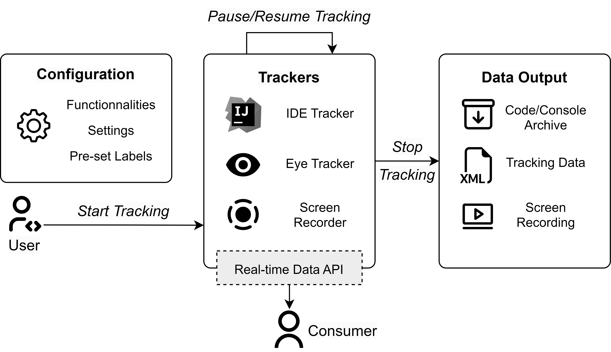

# CodeGRITS

[](https://codegrits.github.io/CodeGRITS/)
[](https://codegrits.github.io/CodeGRITS/static/paper.pdf)
[](https://www.youtube.com/watch?v=d-YsJfW2NMI)
[](https://archive.softwareheritage.org/swh:1:dir:your-directory-id)
[](https://github.com/codegrits/CodeGRITS/blob/main/LICENSE)

[CodeGRITS](https://codegrits.github.io/CodeGRITS/) stands for **G**aze **R**ecording & **I**DE **T**racking **S**ystem.
It's a plugin developed by the [SaNDwich Lab](https://toby.li/) and is specially designed for empirical software
engineering researchers. CodeGRITS is built on top
of [IntelliJ Platform SDK](https://plugins.jetbrains.com/docs/intellij/welcome.html), with wide compatibility with the
entire family of [JetBrains IDEs](https://www.jetbrains.com/) and [Tobii eye-tracking devices](https://www.tobii.com/),
to track developers’ IDE interactions and eye gaze data.

<p align="center">
    
</p>

The data collected by CodeGRITS can be used by empirical SE researchers to understand the behaviors of developers,
especially those related to eye gaze. CodeGRITS also provides a [real-time data API](developer.md)
for future plugin developers and researchers to design context-aware programming support tools.

We provide an example project [DataStreamReceiver](https://github.com/codegrits/DataStreamReceiver) that builds on top
of the real-time data API. It is designed to receive the IDE and eye tracking data and directly visualize them in two
separate windows.

## Key Features

- :mag: **IDE Tracking**: CodeGRITS tracks developers’ IDE interactions, including mouse clicks, keyboard inputs, etc.
- :eye: **Eye Tracking**: CodeGRITS tracks developers’ eye gaze data
  from [Tobii eye-tracking devices](https://www.tobii.com/), and maps them to corresponding source code elements.
- :computer: **Screen Recording**: CodeGRITS simultaneously records developers’ screen for visualizing their behaviors.
- 🔨 **Research Toolkit**: CodeGRITS provides a set of extra features for empirical SE
  researchers, including dynamic configuration, activity labeling, real-time data API, etc.
- 🗃️ **Data Export**: CodeGRITS exports data in XML format for further data analysis. See [Data Format](data.md)
  for more details.

### Cross-platform and Multilingual Support

- [x] CodeGRITS provides cross-platform support for Windows, macOS,
  and Linux, and is expected to be compatible with the entire family of JetBrains IDEs, including IntelliJ IDEA,
  PyCharm, WebStorm, etc.
- [x] CodeGRITS could extract the abstract syntax tree (AST) structure of eye gazes on multiple
  programming languages, as long as the IDE supports them, including Java, Python, C/C++, JavaScript, etc.

## Usage Guide

Please see the [CodeGRITS website](https://codegrits.github.io/CodeGRITS/) for more details.

## Citation

The paper of CodeGRITS has been accepted
by [ICSE 2024 Demonstrations Track](https://conf.researchr.org/track/icse-2024/icse-2024-demonstrations).
The PDF version is available [here](https://codegrits.github.io/CodeGRITS/static/paper.pdf).
The [video demonstration](https://www.youtube.com/watch?v=d-YsJfW2NMI) is available on YouTube.

Please cite the following if you use CodeGRITS in your research.

```bibtex
@inproceedings{tang2024codegrits,
  title={CodeGRITS: A Research Toolkit for Developer Behavior and Eye Tracking in IDE},
  author={Tang, Ningzhi and An, Junwen and Chen, Meng and Bansal, Aakash and Huang, Yu and McMillan, Collin and Li, Toby Jia-Jun},
  booktitle={46th International Conference on Software Engineering Companion (ICSE-Companion '24)},
  year={2024},
  organization={ACM}
}
```

## Contact us

Please feel free to contact Ningzhi Tang at ntang@nd.edu or Junwen An at jan2@nd.edu
if you have any questions or suggestions.