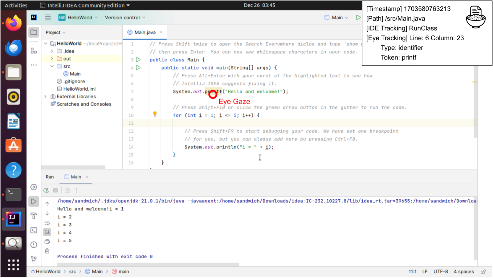

# Welcome to CodeGRITS

!!! 🚀 Install CodeGRITS from JetBrains Marketplace!

You can now install **CodeGRITS** directly from the [JetBrains Plugin Marketplace](https://plugins.jetbrains.com/plugin/28118-codegrits) — fully integrated with any IntelliJ-based IDEs!

💡 If you find CodeGRITS useful, please consider giving us a ⭐ on [GitHub](https://github.com/codegrits/CodeGRITS) — it helps others discover the project!
!!!

!!! 🏆 ICSE 2024 Artifact Badges Awarded! 🔥
CodeGRITS has received the **Artifact Available** and **Artifact Evaluated** badges for its commitment to reproducibility!
!!!

CodeGRITS stands for **G**aze **R**ecording & **I**DE **T**racking **S**ystem. It's a plugin developed by
the [SaNDwich Lab](https://toby.li/) and is specifically designed for empirical software engineering researchers.
CodeGRITS is built on top
of [IntelliJ Platform SDK](https://plugins.jetbrains.com/docs/intellij/welcome.html), with broad compatibility with the
entire family of JetBrains IDEs and [Tobii eye-tracking devices](https://www.tobii.com/),
to track developers’ IDE interactions and eye gaze data. The source code is available
on [GitHub](https://github.com/codegrits/CodeGRITS) with [Javadoc](docs/index.html) documentation.

<div style="text-align: center;">
    <br><br>
</div>

The data collected by CodeGRITS can be used by empirical SE researchers to understand the behaviors of developers,
especially those related to eye gaze. CodeGRITS also provides a [real-time data API](developer.md)
for future plugin developers and researchers to design context-aware programming support tools.

!!!
CodeGRITS is still in its developmental stage as a research tool. Our goal is to make it mature enough and beneficial
for the community. We encourage you to contribute through [GitHub Issue](https://github.com/codegrits/CodeGRITS/issues) for any
suggestions or problems, aiding in its improvement.

For any inquiries, please email us at ntang@nd.edu or ningzhitang2001@gmail.com. If you're interested in
using CodeGRITS in your research, don't hesitate to email us for setup support.
!!!

### Cross-platform and Multilingual Support

- [x] CodeGRITS provides cross-platform support for Windows, macOS, and Linux, and is expected to be compatible with the entire family of JetBrains IDEs, including IntelliJ IDEA, PyCharm, WebStorm, etc.
- [x] CodeGRITS could extract the abstract syntax tree (AST) structure of eye gazes on multiple programming languages, as long as the IDE supports them, including Java, Python, C/C++, JavaScript, etc.

## Key Features

- :mag: **IDE Tracking**: CodeGRITS tracks developers’ IDE interactions, including mouse clicks, keyboard inputs, etc.
- :eye: **Eye Tracking**: CodeGRITS tracks developers’ eye gaze data
  from [Tobii eye-tracking devices](https://www.tobii.com/), and maps them to corresponding source code elements.
- :computer: **Screen Recording**: CodeGRITS simultaneously records developers’ screen for visualizing their behaviors.
- 🔨 **Research Toolkit**: CodeGRITS provides a set of extra features for empirical SE
  researchers, including dynamic configuration, activity labeling, real-time data API, etc.
- 🗃️ **Data Export**: CodeGRITS exports data in XML format for further data analysis. See [Data Format](data.md)
  for more details.

<div style="text-align: center;">
    
</div>

## Citation

The paper of CodeGRITS has been accepted
by [ICSE 2024 Demonstrations Track](https://conf.researchr.org/track/icse-2024/icse-2024-demonstrations).
The PDF version is available [here](static/paper.pdf).
Please cite the following if you use CodeGRITS in your research.

```bibtex
@inproceedings{tang2024codegrits,
  title={CodeGRITS: A Research Toolkit for Developer Behavior and Eye Tracking in IDE},
  author={Tang, Ningzhi and An, Junwen and Chen, Meng and Bansal, Aakash and Huang, Yu and McMillan, Collin and Li, Toby Jia-Jun},
  booktitle={46th International Conference on Software Engineering Companion (ICSE-Companion '24)},
  year={2024},
  organization={ACM}
}
```